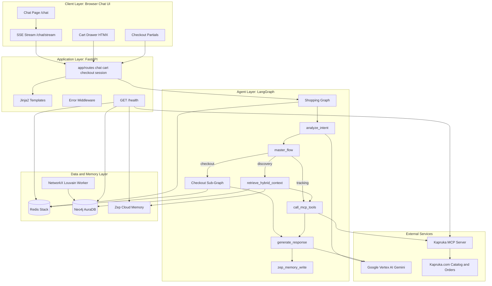

# AgenticKapruka: Conversational Gift Commerce

[](https://cloud.google.com/run)
[](https://www.python.org/)
[](https://htmx.org/)
[](https://langchain-ai.github.io/langgraph/)
[](VERSION)

An agentic shopping assistant for [Kapruka](https://www.kapruka.com), Sri Lanka's largest e-commerce platform. Customers browse gifts, get personalized recommendations, complete multi-step checkout in natural language, and track deliveries — all through a single chat interface backed by live Kapruka product data.

AgenticKapruka combines conversational AI (Google Gemini on Vertex AI), a knowledge graph of occasions and gift categories (Neo4j GraphRAG), long-term customer memory (Zep), and the Kapruka MCP server for real-time catalog, delivery, and order APIs.

---

## What Customers Experience

| Capability | What it means for shoppers |
| --- | --- |
| **Concierge chat workspace** | Purple sidebar nav, suggestion chips, fixed composer, and a **New Session** control that rotates the chat thread while preserving cart items. |
| **Natural-language discovery** | Ask for gifts by occasion, budget, or recipient — a bounded agent loop searches Kapruka's live catalog and shows curated product carousels in chat. |
| **Smart clarifying questions** | Vague requests ("gift ideas") trigger specificity scoring before search — the assistant asks for product type, occasion, or budget instead of guessing. |
| **Carousel references** | Say "add the first one" or "that cake" to cart the product from the last carousel without repeating the name. |
| **Personalized suggestions** | Past preferences (currency, occasions, gift types) are remembered across sessions via Zep memory and Neo4j category graphs. |
| **Guided checkout** | Cart, delivery city/date, recipient, sender, and order review run as a deterministic step-by-step flow inside the conversation. |
| **Order tracking** | Provide an order number and receive live delivery status from Kapruka. |
| **Support FAQ handoff** | Returns, refunds, cancellations, and quality issues route to official Kapruka policy links and support phone — not invented policy text. |
| **Multi-currency** | Prices display in LKR, USD, GBP, AUD, CAD, or EUR based on session preference. |

Full product walkthrough: [docs/tutorial-first-conversation.md](docs/tutorial-first-conversation.md)

---

## Architectural Overview

The platform splits into a browser chat UI (HTMX + server-rendered HTML), a FastAPI application layer, and two LangGraph orchestration graphs — one for shopping turns and one for checkout steps. External services handle memory, graph search, caching, and Kapruka API access.



---

## Shopping Conversation Pipeline

Each customer message triggers a LangGraph run that classifies intent, retrieves context, calls Kapruka tools when needed, and streams an HTML reply.

### Intent Classification and Routing Guards

Keyword guards and Gemini 2.5 Flash classify every message into one of five intents:

- **discovery** — browsing, searching, product questions (default shopping path)
- **cart** — "add … to cart", carousel ordinal references ("the first one")
- **checkout** — cart review, delivery, recipient, payment
- **tracking** — order status and delivery progress
- **general** — greetings, thanks, off-topic, impossible catalog requests, support FAQ

Before search runs, a **request specificity scorer** (`lib/chat/request_specificity.py`) gates vague gift queries. Scores below the proceed threshold produce a clarifying question (product type, occasion, or budget) instead of a blind catalog search. Budgeted gift-idea chips and explicit product IDs bypass the gate.

After intent classification, a **flow-state supervisor** (`lib/chat/master_flow.py`, `graphs/nodes/master_flow.py`) runs on conflict triggers — for example, delivery-only questions with a stale carousel, checkout vs discovery mismatch, or long-session budget drift. It may reset discovery context, pause or exit checkout, or emit a clarifying question before HybridRAG runs. Post-supervisor routing is centralized in `lib/chat/routing.py`.

Routing is deterministic after classification: checkout enters the checkout sub-graph; cart resolves carousel references then executes the add; tracking skips graph retrieval and goes straight to MCP tools; support FAQ and off-topic turns short-circuit to curated reply copy.

### HybridRAG Context Retrieval

For discovery intents, the system embeds the user's query (Vertex AI `gemini-embedding-2`), vector-searches Neo4j gift-category ontology, traverses related occasions and product types, and merges Zep-stored preferences (currency, occasions, past interests). The result guides MCP search parameters — for example, narrowing to "birthday cakes" instead of searching the entire catalog.

### Bounded Agent Loop and Product Curation

Discovery turns that pass specificity and delivery preflight enter a **bounded ReAct agent loop** (`agent_loop`, max 3 iterations). A Flash-tier planner chooses MCP tool calls (`search_products`, `get_product`, `check_delivery`, etc.). Results pass through **product curation** filters — birthday cake focus, chocolate vs floral demotion, recipient-aware ranking, gift-noise removal (grocery/snacks), budget banding, and anniversary graph hints — before the carousel renders.

Long searches rotate customer-facing status copy ("Searching our catalog…", "Curating options for your budget…") via SSE.

### Kapruka MCP Tool Execution

Live Kapruka data flows through a unified service facade with per-IP rate limiting, automatic retry on rate-limit responses, and read caching in Redis:

| Tool | Purpose |
| --- | --- |
| `kapruka_search_products` | Full-text catalog search with filters |
| `kapruka_get_product` | Single product detail by ID |
| `kapruka_list_categories` | Category tree navigation |
| `kapruka_track_order` | Delivery status lookup |
| `kapruka_list_delivery_cities` | City autocomplete for checkout |
| `kapruka_check_delivery` | Delivery date and fee validation |
| `kapruka_create_order` | Order placement (checkout finalize) |

### Response Generation and Memory

Gemini synthesizes a conversational reply strictly from tool results (no hallucinated prices or stock). Product results render as HTMX carousels; tracking renders status cards. After each turn, salient facts are written back to Zep for future personalization.

Model routing escalates to Gemini 2.5 Pro for checkout review and complex multi-tool turns.

---

## Checkout State Machine

Checkout runs as a separate LangGraph with seven ordered steps. Customers cannot skip ahead — each step must validate before advancing.

```
cart → delivery_city → delivery_date → recipient → sender → review → finalize
```

Redis holds cart items and checkout field state per session. The review step uses Pro-tier Gemini to summarize the order before generating a secure Kapruka payment link.

Details: [docs/howto-complete-checkout.md](docs/howto-complete-checkout.md)

---

## Co-Purchase Recommendations

A background NetworkX worker runs Louvain community detection on co-purchase edges in Neo4j, writing `RECOMMENDS` relationships between products in the same community. This powers "customers also bought" style suggestions without GPU dependencies in production.

An optional cuGraph GPU path exists for local development only (`Dockerfile.cuda`).

---

## Technical Prerequisites

| Component | Minimum | Notes |
| --- | --- | --- |
| Python | 3.12+ | Primary runtime |
| Redis Stack | Latest | Sessions, cart, LangGraph checkpointer (RediSearch required) |
| Neo4j AuraDB | 5.x | GraphRAG ontology and vector search |
| Zep Cloud | 2.x | Cross-session conversational memory |
| Google Cloud | Active project | Vertex AI for Gemini chat and embeddings |
| Kapruka MCP | Public endpoint | Default: `https://mcp.kapruka.com/mcp` |

---

## Quick Start (Developers)

```bash
python -m venv .venv
source .venv/bin/activate
pip install -e '.[dev]'
./scripts/bootstrap_env.sh
gcloud auth application-default login
docker run -d --name agentic-kapruka-redis -p 6379:6379 redis/redis-stack-server:latest
# Edit NEO4J_*, ZEP_API_KEY, SESSION_SECRET in .env
# Required for GraphRAG curation quality — run before first local chat/eval session:
python scripts/bootstrap_neo4j.py   # first time: schema, ingest, embed, vector index (required for local GraphRAG / product curation quality)
uvicorn app.main:app --reload
```

Open [http://localhost:8000/chat](http://localhost:8000/chat).

Full setup walkthrough: [docs/howto-developer-setup.md](docs/howto-developer-setup.md)

### Quality Checks

```bash
ruff check .
ruff format --check .
mypy app/ lib/ graphs/
pytest tests/unit -q
```

### Production Deploy

```bash
./scripts/verify_production_prerequisites.sh   # GCP + GitHub secrets checklist
python scripts/bootstrap_neo4j.py              # once against production Aura
./scripts/deploy_cloud_run.sh --dry-run        # preview
./scripts/deploy_cloud_run.sh                  # build, push, deploy
```

`/health` requires all five services up, including `neo4j_graphrag`. Full walkthrough: [docs/DEPLOY.md](docs/DEPLOY.md)

---

## Documentation

Structured documentation follows the [Diataxis](https://diataxis.fr/) framework — tutorials, how-tos, reference, and explanation docs for different reader needs.

| Document | Quadrant | Audience |
| --- | --- | --- |
| [docs/README.md](docs/README.md) | Index | Everyone |
| [docs/explanation-product-overview.md](docs/explanation-product-overview.md) | Explanation | Business stakeholders |
| [docs/explanation-shopping-journey.md](docs/explanation-shopping-journey.md) | Explanation | Product and CX teams |
| [docs/explanation-architecture.md](docs/explanation-architecture.md) | Explanation | Technical leads |
| [docs/tutorial-first-conversation.md](docs/tutorial-first-conversation.md) | Tutorial | New users and QA |
| [docs/howto-find-and-order-gifts.md](docs/howto-find-and-order-gifts.md) | How-to | Shoppers and testers |
| [docs/howto-complete-checkout.md](docs/howto-complete-checkout.md) | How-to | Shoppers and testers |
| [docs/howto-track-delivery.md](docs/howto-track-delivery.md) | How-to | Shoppers and support |
| [docs/howto-developer-setup.md](docs/howto-developer-setup.md) | How-to | Engineers |
| [docs/reference-customer-capabilities.md](docs/reference-customer-capabilities.md) | Reference | Business and QA |
| [docs/reference-http-api.md](docs/reference-http-api.md) | Reference | Integrators |
| [docs/reference-environment.md](docs/reference-environment.md) | Reference | DevOps |
| [docs/DEPLOY.md](docs/DEPLOY.md) | How-to | DevOps |
| [DESIGN.md](DESIGN.md) | Reference | UI tokens, layout, accessibility |

Contributor conventions: [AGENTS.md](AGENTS.md)

---

## Project Layout

```
app/          FastAPI routes, config, middleware, templating
lib/          Business logic — Kapruka MCP, Redis, Neo4j, Zep, checkout, chat
graphs/       LangGraph shopping and checkout orchestration
templates/    Jinja2 HTML partials (chat, cart, checkout components)
static/       Compiled CSS, HTMX/Alpine.js client scripts
tests/        Unit, integration, browser, and e2e tests (143 test modules)
scripts/      Deploy, Neo4j bootstrap, env bootstrap, Ralph loop
evals/        RAGAS evaluation harness and golden dataset
docs/         Diataxis documentation
```

### Module Index

```
app/
├── main.py                 # FastAPI factory, route mounting
├── lifespan.py             # Redis, Neo4j, Zep, MCP startup/shutdown
├── routes/
│   ├── chat.py             # Chat page and SSE streaming
│   ├── cart.py             # Add/remove/update cart items
│   ├── checkout.py         # Delivery and recipient form validation
│   ├── session.py          # Currency preference
│   ├── partials.py         # HTMX search and autocomplete fragments
│   └── health.py           # Dependency health aggregation

graphs/
├── shopping_graph.py       # Main agent graph (intent → tools → response)
├── checkout_graph.py       # Deterministic checkout step machine
├── model_router.py         # Flash vs Pro model selection
└── nodes/
    ├── analyze_intent.py           # Routing guards, specificity gate, topic pivots
    ├── master_flow.py              # Flow-state supervisor (conflict triggers)
    ├── retrieve_hybrid_context.py  # Neo4j + Zep hybrid context
    ├── resolve_delivery_context.py # City/date preflight before agent loop
    ├── agent_loop.py               # Bounded ReAct planner + curation
    ├── call_mcp_tools.py
    ├── resolve_cart_product.py     # Ordinal/deictic carousel references
    ├── execute_cart_action.py
    ├── generate_response.py
    ├── run_checkout_graph.py
    ├── load_zep_memory.py
    └── zep_memory_write.py

lib/
├── kapruka/                # MCP client, service facade, tool wrappers
├── neo4j/                  # GraphRAG ontology, vector search, traversal
├── redis/                  # Sessions, cart, cache, rate limits, checkpointer
├── zep/                    # Memory threads, preferences, facts
├── checkout/               # Payment, delivery, recipient, chat parsing
├── chat/                   # SSE streaming, session rotation, specificity,
│                           # master_flow, routing, product curation,
│                           # support FAQ, off-topic guards
├── analytics/              # NetworkX Louvain recommendation worker
└── genai/                  # Vertex AI Gemini client factory
```

---

## Health and Observability

```bash
curl -s http://localhost:8080/health
```

```json
{
  "status": "healthy",
  "services": {
    "redis": {"status": "up"},
    "neo4j": {"status": "up"},
    "zep": {"status": "up"},
    "mcp": {"status": "up"}
  }
}
```

Returns HTTP 503 with `"status": "degraded"` when any dependency is down.

---

## Ralph Autonomous Workflow

PRD backlog lives in `prd.json`. Progress is logged in `progress.txt`.

```bash
./scripts/ralph-once.sh          # single supervised iteration
./scripts/ralph-once.sh -i       # interactive Cursor Agent UI
./scripts/ralph.sh 10            # AFK loop (10 iterations)
```

Work happens on branch `ralph/sprint-1`. One PRD item per commit: `feat(PRD-XXX): title`.

---

## Code Audit Summary

| Area | Files | Test modules | Status |
| --- | ---: | ---: | --- |
| Application routes | 7 | 15+ | Typed, async-first |
| LangGraph agents | 2 graphs, 8+ nodes | 20+ | Intent routing tested |
| Kapruka integration | 8 MCP tools | 25+ | Rate-limited, cached reads |
| Neo4j GraphRAG | 6 modules | 10+ | Ontology + vector search |
| Checkout flow | 7 steps | 30+ | Deterministic state machine |
| Chat streaming | SSE + HTMX + status copy | 20+ | Browser harness tests |
| Discovery curation | specificity + agent loop + curation | 15+ | Budget, pivot, carousel ref tests |
| Concierge UI | sidebar, cart drawer split | 10+ | Playwright + snapshot tests |
| Deployment | Cloud Run + CI | 5+ | Scripted deploy + dry-run |

**Version:** 0.0.15.2 | **Python:** 3.12+ | **Production target:** Google Cloud Run
